# Breadboard: Issues #10, #11, #12 — File Ownership Verification

**Purpose:** Verify that no file is touched by more than one issue when implementing these three crates in parallel.

**Input:** Shaping documents for [#10 authn](authn-shaping.md), [#11 authz](authz-shaping.md), [#12 http](http-shaping.md).

---

## Places

| #   | Place                     | Description                                  | Owner     |
| --- | ------------------------- | -------------------------------------------- | --------- |
| P1  | forgeguard_core           | Shared primitives (existing, done)           | #7 (done) |
| P2  | forgeguard_authn_core     | Identity resolution traits (existing, done)  | #8 (done) |
| P3  | forgeguard_authz_core     | Policy engine traits (existing, done)        | #9 (done) |
| P4  | forgeguard_authn          | Cognito JWT resolver                         | **#10**   |
| P5  | forgeguard_authz          | Verified Permissions client                  | **#11**   |
| P6  | forgeguard_http           | Route matching, config, HTTP adapter         | **#12**   |
| P7  | Workspace root            | Cargo.toml, shared config                    | shared    |
| P8  | forgeguard_proxy (future) | Consumer of P4, P5, P6                       | #13       |

---

## Code Affordances — #10 forgeguard_authn (P4)

| #    | Place | File                          | Affordance                                       | Control | Wires Out       | Returns To |
| ---- | ----- | ----------------------------- | ------------------------------------------------ | ------- | --------------- | ---------- |
| N1   | P4    | `authn/src/config.rs`         | `JwtResolverConfig::new(jwks_url, issuer)`       | call    | —               | → N6       |
| N2   | P4    | `authn/src/config.rs`         | `.with_audience()`, `.with_user_id_claim()`, etc | call    | —               | → N1       |
| N3   | P4    | `authn/src/jwks.rs`           | `JwksCache::new(ttl)`                            | call    | —               | → N6       |
| N4   | P4    | `authn/src/jwks.rs`           | `JwksCache::get_key(kid)`                        | call    | → N5 (on miss)  | → N8       |
| N5   | P4    | `authn/src/jwks.rs`           | `fetch_jwks(client, url)` — **only I/O**         | call    | → reqwest       | → N4       |
| N6   | P4    | `authn/src/resolver.rs`       | `CognitoJwtResolver::new(config, client)`        | call    | —               | → P8       |
| N7   | P4    | `authn/src/resolver.rs`       | `IdentityResolver::can_resolve()`                | call    | —               | → P8       |
| N8   | P4    | `authn/src/resolver.rs`       | `IdentityResolver::resolve(credential)`          | call    | → N4, → N9, → N10 | → P8    |
| N9   | P4    | `authn/src/resolver.rs`       | `jsonwebtoken::decode(token, key, validation)`   | call    | —               | → N10      |
| N10  | P4    | `authn/src/claims.rs`         | `map_claims(claims, config) -> Identity` (pure)  | call    | → **N50**       | → N8       |
| N11  | P4    | `authn/src/error.rs`          | `Error` enum                                     | type    | —               | —          |
| N12  | P4    | `authn/src/lib.rs`            | pub exports, `#![deny(...)]`                     | module  | —               | —          |
| N13  | P4    | `authn/Cargo.toml`            | crate dependencies                               | config  | —               | —          |

## Code Affordances — #11 forgeguard_authz (P5)

| #    | Place | File                          | Affordance                                           | Control | Wires Out       | Returns To |
| ---- | ----- | ----------------------------- | ---------------------------------------------------- | ------- | --------------- | ---------- |
| N20  | P5    | `authz/src/config.rs`         | `VpEngineConfig::new(policy_store_id)`               | call    | —               | → N25      |
| N21  | P5    | `authz/src/cache.rs`          | `AuthzCache::new(ttl, max_entries)`                  | call    | —               | → N25      |
| N22  | P5    | `authz/src/cache.rs`          | `AuthzCache::get(key) -> Option<PolicyDecision>`     | call    | —               | → N26      |
| N23  | P5    | `authz/src/cache.rs`          | `AuthzCache::insert(key, decision)`                  | call    | —               | → N26      |
| N24  | P5    | `authz/src/cache.rs`          | `cache_hits()` / `cache_misses()` (AtomicU64)        | call    | —               | → P8       |
| N25  | P5    | `authz/src/engine.rs`         | `VpPolicyEngine::new(client, config, project_id)`    | call    | —               | → P8       |
| N26  | P5    | `authz/src/engine.rs`         | `PolicyEngine::evaluate(query)` — orchestration      | call    | → N22, → N27, → N28, → N23 | → P8 |
| N27  | P5    | `authz/src/translate.rs`      | `build_vp_request(query, store_id)` (pure)           | call    | —               | → N26      |
| N28  | P5    | `authz/src/translate.rs`      | VP SDK `is_authorized()` — **only I/O**              | call    | → AWS VP        | → N29      |
| N29  | P5    | `authz/src/translate.rs`      | `translate_vp_response(response)` (pure)             | call    | —               | → N26      |
| N30  | P5    | `authz/src/error.rs`          | `Error` enum                                         | type    | —               | —          |
| N31  | P5    | `authz/src/lib.rs`            | pub exports, `#![deny(...)]`                         | module  | —               | —          |
| N32  | P5    | `authz/Cargo.toml`            | crate dependencies                                   | config  | —               | —          |

## Code Affordances — #12 forgeguard_http (P6)

| #    | Place | File                          | Affordance                                           | Control | Wires Out       | Returns To |
| ---- | ----- | ----------------------------- | ---------------------------------------------------- | ------- | --------------- | ---------- |
| N40  | P6    | `http/src/method.rs`          | `HttpMethod` enum (Get, Post, ..., Any)              | type    | —               | —          |
| N41  | P6    | `http/src/path.rs`            | `PathPattern::from_str(s)` (parse)                   | call    | —               | → N44      |
| N42  | P6    | `http/src/route.rs`           | `RouteMapping` struct                                | type    | —               | —          |
| N43  | P6    | `http/src/route.rs`           | `MatchedRoute` struct                                | type    | —               | → N60, N62 |
| N44  | P6    | `http/src/route.rs`           | `RouteMatcher::new(routes)` — builds `matchit` trie  | call    | —               | → N45      |
| N45  | P6    | `http/src/route.rs`           | `RouteMatcher::match_request(method, path)` (pure)   | call    | —               | → P8       |
| N46  | P6    | `http/src/public.rs`          | `PublicAuthMode` enum (Anonymous, Opportunistic)     | type    | —               | —          |
| N47  | P6    | `http/src/public.rs`          | `PublicMatch` enum (NotPublic, Anonymous, Opportunistic) | type | —              | —          |
| N48  | P6    | `http/src/public.rs`          | `PublicRouteMatcher::check(method, path)` (pure)     | call    | —               | → P8       |
| N50  | P6    | `http/src/config.rs`          | `ProxyConfig` struct + getters                       | type    | —               | —          |
| N51  | P6    | `http/src/config.rs`          | `AuthConfig`, `AuthzConfig`, `DefaultPolicy`, etc    | type    | —               | —          |
| N52  | P6    | `http/src/config_raw.rs`      | `RawProxyConfig` — TOML serde structs                | type    | —               | → N53      |
| N53  | P6    | `http/src/config.rs`          | `TryFrom<RawProxyConfig> for ProxyConfig` (parse)    | call    | → N55           | → N54      |
| N54  | P6    | `http/src/config.rs`          | `load_config(path)` — **only I/O**                   | call    | → toml, → N53   | → P8       |
| N55  | P6    | `http/src/validate.rs`        | `validate(config) -> Result<(), Vec<ValidationError>>` (pure) | call | —        | → N54      |
| N56  | P6    | `http/src/validate.rs`        | Duplicate route detection                            | call    | —               | → N55      |
| N57  | P6    | `http/src/validate.rs`        | Feature gate reference validation                    | call    | —               | → N55      |
| N58  | P6    | `http/src/validate.rs`        | Policy/group reference validation                    | call    | —               | → N55      |
| N59  | P6    | `http/src/config.rs`          | `apply_overrides(config, opts)` (pure)               | call    | —               | → P8       |
| N60  | P6    | `http/src/credential.rs`      | `extract_credential(headers) -> Option<Credential>`  | call    | —               | → P8       |
| N61  | P6    | `http/src/headers.rs`         | `IdentityProjection` struct                          | type    | —               | —          |
| N62  | P6    | `http/src/headers.rs`         | `inject_headers(projection) -> Vec<(String, String)>` (pure) | call | —        | → P8       |
| N63  | P6    | `http/src/headers.rs`         | `inject_client_ip(ip) -> (String, String)` (pure)    | call    | —               | → P8       |
| N64  | P6    | `http/src/query.rs`           | `build_query(identity, route, project_id, ip)` (pure) | call   | —               | → P8       |
| N65  | P6    | `http/src/error.rs`           | `Error`, `ValidationError`, `ValidationWarning`      | type    | —               | —          |
| N66  | P6    | `http/src/lib.rs`             | pub exports, `#![deny(...)]`                         | module  | —               | —          |
| N67  | P6    | `http/Cargo.toml`             | crate dependencies                                   | config  | —               | —          |

## Code Affordances — Cross-crate Reads (existing, not modified)

These existing affordances are *consumed* by #10, #11, #12 but the files are **not modified**.

| #    | Place | File                             | Affordance                         | Consumed by        |
| ---- | ----- | -------------------------------- | ---------------------------------- | ------------------ |
| E1   | P1    | `core/src/segment.rs`            | `UserId`, `TenantId`, `GroupName`  | #10, #11, #12      |
| E2   | P1    | `core/src/fgrn.rs`               | `Fgrn::as_vp_entity_id()`         | #11                |
| E3   | P1    | `core/src/action.rs`             | `QualifiedAction`, VP methods      | #11, #12           |
| E4   | P1    | `core/src/features.rs`           | `FlagConfig`, `FlagName`           | #12                |
| E5   | P1    | `core/src/permission.rs`         | `Policy`, `GroupDefinition`        | #12                |
| E6   | P2    | `authn-core/src/resolver.rs`     | `IdentityResolver` trait           | #10                |
| E7   | P2    | `authn-core/src/credential.rs`   | `Credential` enum                  | #10, #12           |
| E8   | P2    | `authn-core/src/identity.rs`     | `Identity` struct + getters        | #10, #12           |
| E9   | P2    | `authn-core/src/jwt_claims.rs`   | `JwtClaims` struct                 | #10                |
| E10  | P3    | `authz-core/src/engine.rs`       | `PolicyEngine` trait               | #11                |
| E11  | P3    | `authz-core/src/query.rs`        | `PolicyQuery::new()`               | #12                |
| E12  | P3    | `authz-core/src/decision.rs`     | `PolicyDecision`, `DenyReason`     | #11                |
| E13  | P3    | `authz-core/src/context.rs`      | `PolicyContext` builder            | #12                |

## Shared File — Workspace Cargo.toml (P7)

| #    | Place | File            | Change needed                                    | By     |
| ---- | ----- | --------------- | ------------------------------------------------ | ------ |
| S1   | P7    | `Cargo.toml`    | Add `jsonwebtoken`, `url` (for #10)              | **#10** |
| S2   | P7    | `Cargo.toml`    | Add `aws-sdk-verifiedpermissions`, `lru` (for #11) | **#11** |
| S3   | P7    | `Cargo.toml`    | Add `matchit`, `toml` (for #12); add `forgeguard_http` internal crate | **#12** |

---

## File Ownership Matrix

### #10 — forgeguard_authn (all under `crates/authn/`)

| File                        | Owner   | Conflict? |
| --------------------------- | ------- | --------- |
| `crates/authn/Cargo.toml`   | **#10** | No        |
| `crates/authn/src/lib.rs`   | **#10** | No        |
| `crates/authn/src/error.rs`  | **#10** | No        |
| `crates/authn/src/config.rs` | **#10** | No        |
| `crates/authn/src/jwks.rs`   | **#10** | No        |
| `crates/authn/src/claims.rs` | **#10** | No        |
| `crates/authn/src/resolver.rs` | **#10** | No      |

### #11 — forgeguard_authz (all under `crates/authz/`)

| File                          | Owner   | Conflict? |
| ----------------------------- | ------- | --------- |
| `crates/authz/Cargo.toml`    | **#11** | No        |
| `crates/authz/src/lib.rs`    | **#11** | No        |
| `crates/authz/src/error.rs`   | **#11** | No        |
| `crates/authz/src/config.rs`  | **#11** | No        |
| `crates/authz/src/cache.rs`   | **#11** | No        |
| `crates/authz/src/translate.rs` | **#11** | No      |
| `crates/authz/src/engine.rs`  | **#11** | No        |

### #12 — forgeguard_http (all under `crates/http/` — new crate)

| File                             | Owner   | Conflict? |
| -------------------------------- | ------- | --------- |
| `crates/http/Cargo.toml`        | **#12** | No        |
| `crates/http/src/lib.rs`        | **#12** | No        |
| `crates/http/src/error.rs`       | **#12** | No        |
| `crates/http/src/method.rs`      | **#12** | No        |
| `crates/http/src/path.rs`        | **#12** | No        |
| `crates/http/src/route.rs`       | **#12** | No        |
| `crates/http/src/public.rs`      | **#12** | No        |
| `crates/http/src/config.rs`      | **#12** | No        |
| `crates/http/src/config_raw.rs`  | **#12** | No        |
| `crates/http/src/validate.rs`    | **#12** | No        |
| `crates/http/src/credential.rs`  | **#12** | No        |
| `crates/http/src/headers.rs`     | **#12** | No        |
| `crates/http/src/query.rs`       | **#12** | No        |

### Shared file

| File          | Touched by       | Conflict? |
| ------------- | ---------------- | --------- |
| `Cargo.toml` (workspace root) | #10, #11, #12 | **Yes — coordination point** |

---

## Conflict Analysis

### Clean isolation: crate source files

**Zero overlap.** Each issue writes exclusively to its own `crates/<name>/src/` directory:
- #10 → `crates/authn/src/*`
- #11 → `crates/authz/src/*`
- #12 → `crates/http/src/*`

No issue modifies files belonging to another issue or to an existing (done) crate.

### Coordination point: workspace Cargo.toml

All three issues add workspace dependencies to the root `Cargo.toml`. This is a **merge coordination point**, not a true conflict — the additions are in different sections (different dependency lines). Resolution: whoever goes first adds their deps; the others rebase/merge cleanly since TOML dependency lines don't overlap.

### BLOCKER: `Identity::new()` is `pub(crate)` in authn_core

`Identity::new()` at `crates/authn-core/src/identity.rs:27` is `pub(crate)`. The `CognitoJwtResolver` in `crates/authn/` (issue #10) needs to construct `Identity` values from resolved JWT claims — but **it cannot**, because the constructor is crate-private.

The `IdentityBuilder` exists but is gated behind `#[cfg(feature = "test-support")]` — it's for tests, not production code.

**This means #10 requires a prep change to `crates/authn-core/src/identity.rs`** — a file owned by #8 (done). Options:

| Option | Change | File modified |
| ------ | ------ | ------------- |
| A | Change `pub(crate) fn new()` → `pub fn new()` | `authn-core/src/identity.rs` |
| B | Add `pub fn from_resolved(...)` constructor alongside the `pub(crate)` one | `authn-core/src/identity.rs` |
| C | Un-gate `IdentityBuilder` (remove `test-support` feature requirement) | `authn-core/src/lib.rs` + `authn-core/Cargo.toml` |

**Recommendation: Option A.** The `pub(crate)` restriction was protecting against arbitrary construction, but private fields + no `Default` already prevent invalid `Identity` values. The constructor takes fully-typed arguments (`UserId`, `TenantId`, etc.) — Parse Don't Validate is enforced by the argument types, not by visibility. Making it `pub` doesn't weaken any invariant.

This prep change should be done **before** starting #10, or as the first commit of #10's branch.

---

## Wiring Diagram

```mermaid
flowchart TB
    subgraph P1["P1: forgeguard_core (done)"]
        E1["E1: UserId, TenantId, etc."]
        E2["E2: Fgrn::as_vp_entity_id()"]
        E3["E3: QualifiedAction"]
        E4["E4: FlagConfig, FlagName"]
        E5["E5: Policy, GroupDefinition"]
    end

    subgraph P2["P2: forgeguard_authn_core (done)"]
        E6["E6: IdentityResolver trait"]
        E7["E7: Credential enum"]
        E8["E8: Identity struct"]
        E9["E9: JwtClaims struct"]
    end

    subgraph P3["P3: forgeguard_authz_core (done)"]
        E10["E10: PolicyEngine trait"]
        E11["E11: PolicyQuery"]
        E12["E12: PolicyDecision"]
        E13["E13: PolicyContext"]
    end

    subgraph P4["P4: forgeguard_authn (#10)"]
        N1["N1: JwtResolverConfig"]
        N3["N3: JwksCache"]
        N5["N5: fetch_jwks() — I/O"]
        N6["N6: CognitoJwtResolver"]
        N8["N8: resolve()"]
        N9["N9: jwt decode"]
        N10["N10: map_claims() — pure"]
    end

    subgraph P5["P5: forgeguard_authz (#11)"]
        N21["N21: AuthzCache"]
        N25["N25: VpPolicyEngine"]
        N26["N26: evaluate()"]
        N27["N27: build_vp_request() — pure"]
        N28["N28: VP is_authorized() — I/O"]
        N29["N29: translate_vp_response() — pure"]
    end

    subgraph P6["P6: forgeguard_http (#12)"]
        N44["N44: RouteMatcher (matchit)"]
        N45["N45: match_request()"]
        N48["N48: PublicRouteMatcher"]
        N54["N54: load_config() — I/O"]
        N55["N55: validate()"]
        N60["N60: extract_credential()"]
        N62["N62: inject_headers()"]
        N64["N64: build_query()"]
    end

    subgraph P8["P8: forgeguard_proxy (#13 — future)"]
        PROXY["proxy orchestration"]
    end

    %% #10 reads from core crates
    E1 -.-> N10
    E6 -.-> N6
    E7 -.-> N8
    E8 -.-> N10
    E9 -.-> N9

    %% #10 internal wiring
    N1 --> N6
    N3 --> N6
    N8 --> N5
    N8 --> N9
    N9 --> N10

    %% #11 reads from core crates
    E1 -.-> N25
    E2 -.-> N27
    E3 -.-> N27
    E10 -.-> N25
    E12 -.-> N29

    %% #11 internal wiring
    N26 --> N21
    N26 --> N27
    N27 --> N28
    N28 --> N29
    N29 --> N26

    %% #12 reads from core crates
    E1 -.-> N64
    E3 -.-> N44
    E4 -.-> N55
    E5 -.-> N55
    E7 -.-> N60
    E8 -.-> N64
    E11 -.-> N64
    E13 -.-> N64

    %% Proxy consumes all three
    N8 -.-> PROXY
    N26 -.-> PROXY
    N45 -.-> PROXY
    N48 -.-> PROXY
    N54 -.-> PROXY
    N60 -.-> PROXY
    N62 -.-> PROXY
    N64 -.-> PROXY

    classDef done fill:#d3d3d3,stroke:#808080,color:#000
    classDef issue10 fill:#e8f5e9,stroke:#4caf50,color:#000
    classDef issue11 fill:#e3f2fd,stroke:#2196f3,color:#000
    classDef issue12 fill:#fff3e0,stroke:#ff9800,color:#000
    classDef future fill:none,stroke:#ddd,color:#bbb,stroke-dasharray:3 3

    class E1,E2,E3,E4,E5,E6,E7,E8,E9,E10,E11,E12,E13 done
    class N1,N3,N5,N6,N8,N9,N10 issue10
    class N21,N25,N26,N27,N28,N29 issue11
    class N44,N45,N48,N54,N55,N60,N62,N64 issue12
    class PROXY future
```

---

## Summary

| Check | Result |
| ----- | ------ |
| #10 files overlap with #11? | **No** — separate `crates/` directories |
| #10 files overlap with #12? | **No** — separate `crates/` directories |
| #11 files overlap with #12? | **No** — separate `crates/` directories |
| Any issue modifies a done crate? | **Yes — #10 needs `Identity::new()` to be `pub`** in `authn-core/src/identity.rs` |
| Workspace Cargo.toml? | Touched by all three — merge coordination, not conflict |

**Verdict:** File isolation is clean across the three issues **except** for one prep change. `Identity::new()` must become `pub` before #10 can proceed. This is a one-line change to a done crate (#8).
