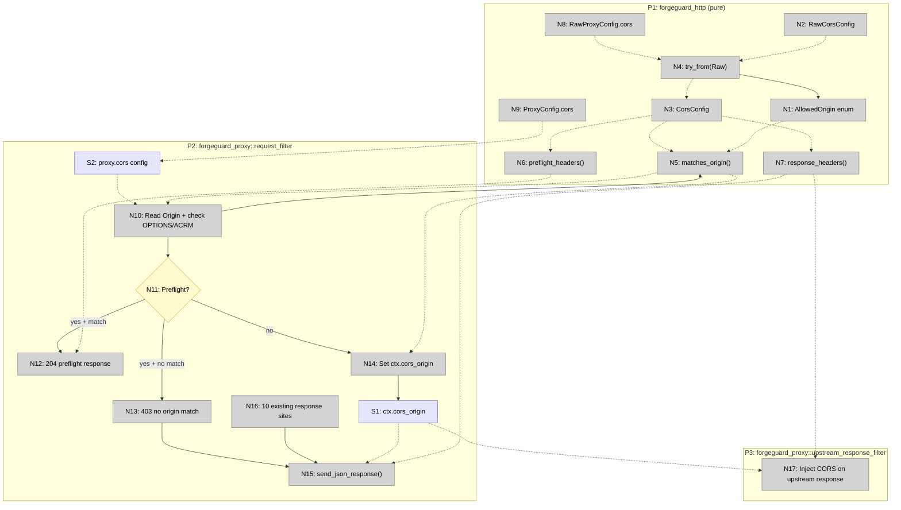

# Global CORS Support — Shaping

## Requirements (R)

| ID  | Requirement                                                                    | Status    |
| --- | ------------------------------------------------------------------------------ | --------- |
| R0  | Proxy handles CORS entirely — upstream remains CORS-unaware                    | Core goal |
| R1  | Preflight (OPTIONS + `Access-Control-Request-Method`) returns 204 before auth  | Must-have |
| R2  | Proxy error responses (401, 403, 404) include CORS headers when origin matches | Must-have |
| R3  | Proxied upstream responses include CORS headers, overwriting upstream's own     | Must-have |
| R4  | No CORS headers when disabled, section absent, or origin doesn't match         | Must-have |
| R5  | Origin matching supports exact, wildcard suffix (`*.example.com`), and `*`     | Must-have |
| R6  | Wildcard `*` + `allow_credentials = true` rejected at config parse time        | Must-have |
| R7  | Pure CORS logic lives in `forgeguard_http`; Pingora wiring in `forgeguard_proxy` | Must-have |
| R8  | All `respond_error_with_body()` calls migrated to support custom headers       | Must-have |

---

## A: Proxy-owns-CORS with response migration

The issue's proposed design. Single shape — well-specified from the spike.

| Part   | Mechanism                                                          | Flag |
| ------ | ------------------------------------------------------------------ | :--: |
| **A1** | `AllowedOrigin` ADT: `Exact(String)`, `Suffix(String)`, `Any`     |      |
| **A2** | `RawCorsConfig` → `CorsConfig` Parse Don't Validate conversion    |      |
| **A3** | `CorsConfig::matches_origin()` → `Option<&str>` (matched origin)  |      |
| **A4** | `preflight_headers()` / `response_headers()` — pure header builders |      |
| **A5** | Preflight interception in `request_filter()` — early-exit 204     |      |
| **A6** | `cors_origin: Option<String>` on `RequestCtx`                     |      |
| **A7** | Error responses inject CORS headers via `send_json_response()`    |      |
| **A8** | `upstream_response_filter()` injects CORS headers on proxied responses |      |
| **A9** | Migrate all 10 `respond_error_with_body()` → `send_json_response()` helper |      |

---

## Fit Check: R × A

| Req | Requirement                                                                    | Status    |  A  |
| --- | ------------------------------------------------------------------------------ | --------- | :-: |
| R0  | Proxy handles CORS entirely — upstream remains CORS-unaware                    | Core goal | ✅  |
| R1  | Preflight (OPTIONS + `Access-Control-Request-Method`) returns 204 before auth  | Must-have | ✅  |
| R2  | Proxy error responses (401, 403, 404) include CORS headers when origin matches | Must-have | ✅  |
| R3  | Proxied upstream responses include CORS headers, overwriting upstream's own     | Must-have | ✅  |
| R4  | No CORS headers when disabled, section absent, or origin doesn't match         | Must-have | ✅  |
| R5  | Origin matching supports exact, wildcard suffix (`*.example.com`), and `*`     | Must-have | ✅  |
| R6  | Wildcard `*` + `allow_credentials = true` rejected at config parse time        | Must-have | ✅  |
| R7  | Pure CORS logic lives in `forgeguard_http`; Pingora wiring in `forgeguard_proxy` | Must-have | ✅  |
| R8  | All `respond_error_with_body()` calls migrated to support custom headers       | Must-have | ✅  |

**No unsolved requirements.** All mechanisms are concrete from the spike.

---

## Parts Detail

### A1: `AllowedOrigin` ADT

Closed variant set parsed from config strings at load time. Lives in `forgeguard_http`.

```rust
pub(crate) enum AllowedOrigin {
    Exact(String),   // "https://app.forgeguard.dev"
    Suffix(String),  // "*.forgeguard.dev" → stores ".forgeguard.dev"
    Any,             // "*"
}
```

Parsing: `"*"` → `Any`, `"*.foo"` → `Suffix(".foo")`, anything else → `Exact(value)`.

### A2: `RawCorsConfig` → `CorsConfig`

`RawCorsConfig` — serde deserialization target with `Option` fields and defaults.
`CorsConfig` — validated, private fields, constructor via `TryFrom<RawCorsConfig>`.

Validation rules (enforced in `TryFrom`):
- `allowed_origins` non-empty when enabled
- `*` origin mutually exclusive with `allow_credentials = true`
- Suffix entries must match `*.` + at least one char
- `max_age_secs > 0`

Errors go through existing `ValidationError` type in the collect-all validation pass.

### A3: `matches_origin()`

```rust
impl CorsConfig {
    pub(crate) fn matches_origin(&self, origin: &str) -> Option<&str>
}
```

Returns the value to set in `Access-Control-Allow-Origin`:
- `Exact` match → returns the exact origin string
- `Suffix` match → returns the request origin (not the suffix)
- `Any` → returns `"*"`
- No match → `None`

### A4: Header builders

Two pure functions returning `Vec<(String, String)>`:

- `preflight_headers(origin)` — full set: Allow-Origin, Allow-Methods, Allow-Headers, Max-Age, Allow-Credentials, Expose-Headers
- `response_headers(origin)` — subset: Allow-Origin, Allow-Credentials, Expose-Headers (no Methods/Headers/Max-Age)

### A5: Preflight interception

In `request_filter()`, after health check, before auth:
1. Check `method == OPTIONS` && `Access-Control-Request-Method` header present
2. If CORS disabled or no origin match → 403, no CORS headers
3. If match → 204 via `write_response_header(Box::new(resp), true)` + `Ok(true)` early exit

### A6: `cors_origin` on `RequestCtx`

One new field: `cors_origin: Option<String>`. Set once in `request_filter()` for all non-preflight requests. Consumed by A7 and A8.

### A7: Error response CORS injection

The `send_json_response()` helper accepts `extra_headers: &[(String, String)]`. When `cors_origin` is `Some`, call `response_headers(origin)` and pass them. When `None`, pass empty slice.

### A8: Upstream response CORS injection

`upstream_response_filter()` checks `ctx.cors_origin`. If `Some`, call `response_headers(origin)` and `insert_header()` on the mutable `ResponseHeader`. Overwrites any upstream CORS headers.

### A9: Response migration

All 10 `respond_error_with_body()` call sites in `proxy.rs` migrate to `send_json_response()`. Two categories:
- **Error responses** (401, 403, 404, 500) → `send_json_response()` using `write_error_response()`
- **Success responses** (200 debug, 200 policy test) → `send_json_response()` using `write_response_header()` + `write_response_body()`

### CorsConfig integration into ProxyConfig

`RawProxyConfig` gains `cors: Option<RawCorsConfig>`. `ProxyConfig` gains `cors: Option<CorsConfig>`. When `None` or `enabled = false`, CORS is fully inert — no performance cost on the request path.

---

## Breadboard: Shape A

### Places

| #  | Place                                      | Description                                                 |
|----|--------------------------------------------|-------------------------------------------------------------|
| P1 | forgeguard_http (pure)                     | Config types, origin matching, header builders              |
| P2 | forgeguard_proxy::request_filter           | Pingora lifecycle hook — preflight, auth, routing, errors   |
| P3 | forgeguard_proxy::upstream_response_filter | New Pingora hook — CORS on proxied responses                |

### Code Affordances

| #   | Place | Component      | Affordance                                               | Control | Wires Out     | Returns To   |
|-----|-------|----------------|----------------------------------------------------------|---------|---------------|--------------|
| N1  | P1    | cors           | `AllowedOrigin` enum (`Exact`, `Suffix`, `Any`)          | type    | —             | → N4, N5     |
| N2  | P1    | cors           | `RawCorsConfig` (serde struct)                           | type    | —             | → N4         |
| N3  | P1    | cors           | `CorsConfig` (validated, private fields)                 | type    | —             | → N5, N6, N7 |
| N4  | P1    | cors           | `CorsConfig::try_from(RawCorsConfig)`                    | call    | → N1          | → N3         |
| N5  | P1    | cors           | `CorsConfig::matches_origin(origin) -> Option<&str>`     | call    | → N1          | → N10, N14   |
| N6  | P1    | cors           | `CorsConfig::preflight_headers(origin) -> Vec<…>`        | call    | —             | → N12        |
| N7  | P1    | cors           | `CorsConfig::response_headers(origin) -> Vec<…>`         | call    | —             | → N15, N17   |
| N8  | P1    | config_raw     | `RawProxyConfig.cors: Option<RawCorsConfig>`             | type    | —             | → N4         |
| N9  | P1    | config         | `ProxyConfig.cors: Option<CorsConfig>`                   | type    | —             | → S2         |
| N10 | P2    | request_filter | Read `Origin` header + check OPTIONS/ACRM                | call    | → N5          | → S1         |
| N11 | P2    | request_filter | Preflight detected? (OPTIONS + ACRM header)              | branch  | → N12, → N13 | —            |
| N12 | P2    | request_filter | 204 preflight response via `write_response_header`       | call    | —             | —            |
| N13 | P2    | request_filter | 403 preflight rejection (origin not matched)             | call    | → N15         | —            |
| N14 | P2    | request_filter | Set `ctx.cors_origin` for non-preflight requests         | call    | → S1          | —            |
| N15 | P2    | proxy          | `send_json_response(session, status, body, extra_headers)` | call  | —             | —            |
| N16 | P2    | proxy          | Existing 10 error/response sites → call N15              | call    | → N15         | —            |
| N17 | P3    | upstream_resp  | Read `ctx.cors_origin`, inject CORS headers              | call    | → N7          | —            |

### Data Stores

| #  | Place | Store                                      | Description                                    |
|----|-------|--------------------------------------------|------------------------------------------------|
| S1 | P2    | `ctx.cors_origin: Option<String>`          | Matched origin, carried across lifecycle hooks |
| S2 | P2    | `ForgeGuardProxy.cors: Option<CorsConfig>` | Validated CORS config, read-only at runtime    |

### Request Flow

| Step | Request type          | Path                                                                           |
|------|-----------------------|--------------------------------------------------------------------------------|
| 1    | Preflight (match)     | N10 → N5 ✓ → N11 → N6 → N12 (204 + CORS headers, early exit)                  |
| 2    | Preflight (no match)  | N10 → N5 ✗ → N11 → N13 → N15 (403, no CORS headers)                           |
| 3    | Normal + origin match | N10 → N5 ✓ → N14 → S1 → …auth pipeline… → N17 (upstream gets CORS)            |
| 4    | Normal + auth fail    | N10 → N5 ✓ → N14 → S1 → …auth fails… → N16 → N15 (401 + CORS from S1)        |
| 5    | CORS disabled         | N10 → S1 stays None → all paths skip CORS headers entirely                    |

### Mermaid



---

## Slices

| #  | Slice                              | Parts      | Affordances              | Demo                                                                  |
|----|------------------------------------|------------|--------------------------|-----------------------------------------------------------------------|
| V1 | Pure CORS logic + config parsing   | A1–A4      | N1–N9                    | `forgeguard check --config` validates CORS; rejects wildcard+credentials |
| V2 | Response migration + preflight     | A5, A9     | N10–N16, S2              | `curl -X OPTIONS` with Origin → 204 + CORS headers                    |
| V3 | Error + upstream CORS injection    | A6–A8      | N7, N14, S1, N17         | 401/403 include CORS headers; upstream responses get CORS              |

**Dependency chain:** V1 → V2 → V3 (strictly sequential)

**Plans:**
- V1: `.claude/plans/2026-03-28-cors-v1-pure-types-config.md`
- V2: (not yet written)
- V3: (not yet written)
