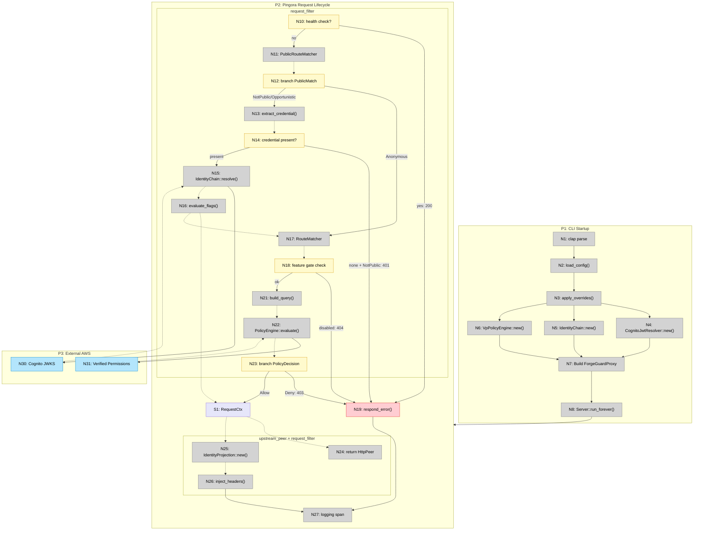

# forgeguard_proxy — Shaping

**GitHub Issue:** [#13 — forgeguard_proxy — Pingora runtime with auth enforcement](https://github.com/cloudbridgeuy/forgeguard/issues/13)
**Labels:** layer-3, proxy, binary, pingora
**Milestone:** target-b-proxy-enforces-auth
**Blocked by:** #8 (done), #9 (done), #10 (done), #11 (done), #12 (done), #16 (folded in — infrastructure complete)
**Unblocks:** #17 (end-to-end demo)

---

## Frame

### Source

> The Pingora runtime binary. Wires all pieces together: implements Pingora's `ProxyHttp` trait using types from `forgeguard_http` (config, route matching, credential extraction, header injection) and domain crates.
>
> All HTTP-to-domain translation logic lives in `forgeguard_http`. This crate maps those operations into Pingora's request lifecycle phases (`request_filter`, `upstream_peer`, `upstream_request_filter`, `logging`).
>
> Only provides the `run` subcommand. `check`, `config`, `routes` live in `forgeguard_cli`.
>
> Built on Cloudflare's Pingora framework (0.8). Linux-only (macOS via Docker).

### Problem

The domain crates (`forgeguard_http`, `forgeguard_authn`, `forgeguard_authz`) exist but have no runtime. There is no binary that receives HTTP traffic, enforces authentication and authorization, and proxies allowed requests upstream. Without this, the entire system is just libraries with no way to run.

### Outcome

A binary (`forgeguard-proxy run`) that sits in front of an application, resolves identity from credentials, evaluates authorization policies, and proxies allowed requests — injecting identity headers for the upstream app.

---

## Requirements (R)

| ID  | Requirement                                                                               | Status    |
| --- | ----------------------------------------------------------------------------------------- | --------- |
| R0  | Binary receives HTTP traffic, enforces auth, proxies to upstream                          | Core goal |
| R1  | Request lifecycle: credential extraction → identity resolution → route match → authz eval | Must-have |
| R2  | Public route bypass: anonymous (skip auth) and opportunistic (try auth, never reject)     | Must-have |
| R3  | Error responses: 401 (no/invalid credential), 403 (denied), 404 (feature-gated disabled), 502 (upstream unreachable) | Must-have |
| R4  | Identity header injection: `X-ForgeGuard-*` headers to upstream                           | Must-have |
| R5  | Health check endpoint: `GET /.well-known/forgeguard/health` → 200 (before auth)           | Must-have |
| R6  | CLI: `forgeguard-proxy run --config forgeguard.toml` with flag > env > config precedence  | Must-have |
| R7  | Structured logging: method, path, status, user, tenant, action, latency_ms                | Must-have |
| R8  | Compiles and runs on developer machines (macOS) without excessive friction                 | Must-have |
| R9  | Thin shell: no business logic in the proxy — all decisions delegated to domain crates      | Must-have |
| R10 | Feature flag evaluation per request and feature-gate enforcement on matched routes         | Must-have |

---

## A: Pingora ProxyHttp

The approach specified in the issue. Implement Cloudflare's `ProxyHttp` trait, mapping Pingora's request lifecycle phases to domain crate calls.

| Part   | Mechanism                                                                                          | Flag |
| ------ | -------------------------------------------------------------------------------------------------- | :--: |
| **A1** | **`ForgeGuardProxy` struct** — holds `IdentityChain`, `Arc<dyn PolicyEngine>`, `RouteMatcher`, `PublicRouteMatcher`, `FlagConfig`, `HttpPeer`, `DefaultPolicy`, `ClientIpSource` |      |
| **A2** | **`RequestCtx`** — per-request state: identity, flags, matched_route, request_start, method, path  |      |
| **A3** | **`request_filter`** — health check → public route check → extract credential → resolve identity → evaluate flags → match route → check feature gate → evaluate policy. Returns `true` (handled, don't proxy) or `false` (continue to upstream) |      |
| **A4** | **`upstream_peer`** — returns `HttpPeer` to upstream from config                                   |      |
| **A5** | **`upstream_request_filter`** — calls `inject_headers(identity, flags, client_ip)` on upstream request |      |
| **A6** | **`logging`** — structured tracing span with method, path, status, user, tenant, action, latency   |      |
| **A7** | **CLI** — `clap` with `run` subcommand, `color_eyre::Result<()>`, flag/env/config precedence       |      |
| **A8** | **Docker** — `Dockerfile.proxy` for production builds and Linux-specific testing only              |      |

---

## Resolved Spikes

### A8 — Docker
Existing `docker/proxy.Dockerfile` (cargo-chef, three-stage) works. Only needs `apt-get install -y cmake clang libssl-dev pkg-config` in builder stage once Pingora is added. CI/CD (`release.yml`) already publishes `ghcr.io/.../forgeguard-proxy` on tags. No dev-loop Docker needed — Pingora compiles natively on macOS.

### Feature Flags (#16)
All infrastructure exists: `evaluate_flags()` (pure), `FlagConfig` in `ProxyConfig`, `feature_gate` on `MatchedRoute`, `ResolvedFlags` in `IdentityProjection` for header injection. Remaining work is ~10 lines of orchestration in `request_filter`. Folded into A3 as steps 5–6.

### Thin Shell / FCIS Compatibility
Pingora's `ProxyHttp` trait is fully compatible with the thin-shell pattern. `&self` is immutable (config/deps on struct, per-request state in `CTX`). Inputs are extractable to pure types (`session.req_header()` → method, URI, headers). Short-circuit is write-then-return: `session.respond_error(status).await; Ok(true)`. The I/O stays in the trait impl; all decisions are pure function calls into `forgeguard_http`. Pingora types never leak into domain crates.

---

## Fit Check: R × A

| Req | Requirement                                                                               | Status    | A   |
| --- | ----------------------------------------------------------------------------------------- | --------- | --- |
| R0  | Binary receives HTTP traffic, enforces auth, proxies to upstream                          | Core goal | ✅  |
| R1  | Request lifecycle: credential extraction → identity resolution → route match → authz eval | Must-have | ✅  |
| R2  | Public route bypass: anonymous (skip auth) and opportunistic (try auth, never reject)     | Must-have | ✅  |
| R3  | Error responses: 401 (no/invalid credential), 403 (denied), 404 (feature-gated disabled), 502 (upstream unreachable) | Must-have | ✅  |
| R4  | Identity header injection: `X-ForgeGuard-*` headers to upstream                           | Must-have | ✅  |
| R5  | Health check endpoint: `GET /.well-known/forgeguard/health` → 200 (before auth)           | Must-have | ✅  |
| R6  | CLI: `forgeguard-proxy run --config forgeguard.toml` with flag > env > config precedence  | Must-have | ✅  |
| R7  | Structured logging: method, path, status, user, tenant, action, latency_ms                | Must-have | ✅  |
| R8  | Compiles and runs on developer machines (macOS) without excessive friction                 | Must-have | ✅  |
| R9  | Thin shell: no business logic in the proxy — all decisions delegated to domain crates      | Must-have | ✅  |
| R10 | Feature flag evaluation per request and feature-gate enforcement on matched routes         | Must-have | ✅  |

---

## Detail A: Breadboard

### Places

| #  | Place                     | Description                                                    |
|----|---------------------------|----------------------------------------------------------------|
| P1 | CLI Startup               | Parse args, load config, build dependencies, start server      |
| P2 | Pingora Request Lifecycle | `ProxyHttp` impl — request_filter, upstream_peer, upstream_request_filter, logging |
| P3 | External AWS Services     | Cognito JWKS, Verified Permissions API                         |

### Code Affordances — P1: CLI Startup

| #    | Component            | Affordance                           | Control | Wires Out      | Returns To |
|------|----------------------|--------------------------------------|---------|----------------|------------|
| N1   | main.rs              | `clap::Parser::parse()`             | call    | → N2           | —          |
| N2   | forgeguard_http      | `load_config(path)`                 | call    | → N3           | —          |
| N3   | forgeguard_http      | `apply_overrides(config, cli_opts)` | call    | → N4, N5, N6   | —          |
| N4   | forgeguard_authn     | `CognitoJwtResolver::new(config)`   | call    | —              | → N7       |
| N5   | forgeguard_authn_core | `IdentityChain::new(resolvers)`    | call    | —              | → N7       |
| N6   | forgeguard_authz     | `VpPolicyEngine::new(config)`       | call    | —              | → N7       |
| N7   | proxy.rs             | Build `ForgeGuardProxy` struct      | call    | → N8           | —          |
| N8   | pingora              | `Server::run_forever()`             | call    | → P2           | —          |

### Code Affordances — P2: request_filter

| #    | Component             | Affordance                                         | Control     | Wires Out              | Returns To |
|------|-----------------------|----------------------------------------------------|-------------|------------------------|------------|
| N10  | proxy.rs              | Check health path `/.well-known/forgeguard/health` | conditional | → N19 (200)            | —          |
| N11  | forgeguard_http       | `PublicRouteMatcher::match_request(method, path)`  | call        | —                      | → N12      |
| N12  | proxy.rs              | Branch on `PublicMatch`                            | conditional | → N13 or → N20         | —          |
| N13  | forgeguard_http       | `extract_credential(headers)`                      | call        | —                      | → N14      |
| N14  | proxy.rs              | Branch on credential presence                      | conditional | → N15 or → N19 (401)  | —          |
| N15  | forgeguard_authn_core | `IdentityChain::resolve(credential)`               | call        | → N30                  | → N16      |
| N16  | forgeguard_core       | `evaluate_flags(config, tenant_id, user_id)`       | call        | —                      | → N17, S1  |
| N17  | forgeguard_http       | `RouteMatcher::match_request(method, path)`        | call        | —                      | → N18      |
| N18  | proxy.rs              | Check `feature_gate` vs `ResolvedFlags`            | conditional | → N19 (404) or → N21  | —          |
| N19  | pingora               | `session.respond_error(status)`                    | call        | → N27                  | —          |
| N21  | forgeguard_http       | `build_query(identity, route, project_id, ip)`     | call        | —                      | → N22      |
| N22  | forgeguard_authz_core | `PolicyEngine::evaluate(query)`                    | call        | → N31                  | → N23      |
| N23  | proxy.rs              | Branch on `PolicyDecision`                         | conditional | → N19 (403) or → S1   | —          |

### Code Affordances — P2: upstream_peer, upstream_request_filter, logging

| #    | Component       | Affordance                                              | Control | Wires Out  | Returns To |
|------|-----------------|---------------------------------------------------------|---------|------------|------------|
| N24  | proxy.rs        | `upstream_peer()` — return `HttpPeer` from config       | call    | —          | → pingora  |
| N25  | forgeguard_http | `IdentityProjection::new(identity, flags, ip)`          | call    | —          | → N26      |
| N26  | forgeguard_http | `inject_headers(projection)` on `&mut RequestHeader`    | call    | —          | → upstream |
| N27  | proxy.rs        | `logging()` — structured tracing span                   | call    | —          | —          |

### Code Affordances — P3: External AWS Services

| #    | Component            | Affordance                        | Control | Wires Out | Returns To |
|------|----------------------|-----------------------------------|---------|-----------|------------|
| N30  | Cognito              | JWKS fetch + JWT signature verify | call    | —         | → N15      |
| N31  | Verified Permissions | `IsAuthorized` API                | call    | —         | → N22      |

### Data Stores

| #  | Place | Store        | Description                                                                    |
|----|-------|--------------|--------------------------------------------------------------------------------|
| S1 | P2    | `RequestCtx` | Per-request: identity, resolved_flags, matched_route, request_start, method, path |

### Diagram

---

## Slices

| #  | Slice                                   | Parts          | Demo |
|----|-----------------------------------------|----------------|------|
| V1 | CLI boot + health check + passthrough   | A7, A1, A4     | `forgeguard-proxy run` starts, `curl /health` → 200, `curl /anything` → proxied to upstream |
| V2 | Auth enforcement + header injection     | A1, A2, A3, A5 | Valid token → proxied with `X-ForgeGuard-*` headers, no token → 401, denied → 403 |
| V3 | Public routes + feature flags + logging | A3, A6         | Public route → no auth needed, feature-gated route → 404, full structured log lines |

### V1: CLI Boot + Health Check + Passthrough

Proves Pingora works, config loads, upstream proxying works.

| #    | Component             | Affordance                           | Control     | Wires Out    | Returns To |
|------|-----------------------|--------------------------------------|-------------|--------------|------------|
| N1   | main.rs               | `clap::Parser::parse()`             | call        | → N2         | —          |
| N2   | forgeguard_http       | `load_config(path)`                 | call        | → N3         | —          |
| N3   | forgeguard_http       | `apply_overrides(config, cli_opts)` | call        | → N4, N5, N6 | —          |
| N4   | forgeguard_authn      | `CognitoJwtResolver::new(config)`   | call        | —            | → N7       |
| N5   | forgeguard_authn_core | `IdentityChain::new(resolvers)`     | call        | —            | → N7       |
| N6   | forgeguard_authz      | `VpPolicyEngine::new(config)`       | call        | —            | → N7       |
| N7   | proxy.rs              | Build `ForgeGuardProxy` struct      | call        | → N8         | —          |
| N8   | pingora               | `Server::run_forever()`             | call        | → P2         | —          |
| N10  | proxy.rs              | Check health path                   | conditional | → N19 (200)  | —          |
| N19  | pingora               | `session.respond_error(200)`        | call        | → N27        | —          |
| N24  | proxy.rs              | `upstream_peer()` — return HttpPeer | call        | —            | → pingora  |
| N27  | proxy.rs              | `logging()` — basic tracing span    | call        | —            | —          |

### V2: Auth Enforcement + Header Injection

The core auth pipeline from credential to decision to upstream headers.

| #    | Component             | Affordance                                      | Control     | Wires Out             | Returns To |
|------|-----------------------|-------------------------------------------------|-------------|-----------------------|------------|
| N13  | forgeguard_http       | `extract_credential(headers)`                   | call        | —                     | → N14      |
| N14  | proxy.rs              | Branch on credential presence                   | conditional | → N15 or → N19 (401) | —          |
| N15  | forgeguard_authn_core | `IdentityChain::resolve(credential)`            | call        | → N30                 | → S1       |
| N17  | forgeguard_http       | `RouteMatcher::match_request(method, path)`     | call        | —                     | → N21      |
| N19  | pingora               | `session.respond_error(status)`                 | call        | → N27                 | —          |
| N21  | forgeguard_http       | `build_query(identity, route, project_id, ip)`  | call        | —                     | → N22      |
| N22  | forgeguard_authz_core | `PolicyEngine::evaluate(query)`                 | call        | → N31                 | → N23      |
| N23  | proxy.rs              | Branch on `PolicyDecision`                      | conditional | → N19 (403) or → S1  | —          |
| N25  | forgeguard_http       | `IdentityProjection::new(identity, flags, ip)`  | call        | —                     | → N26      |
| N26  | forgeguard_http       | `inject_headers(projection)`                    | call        | —                     | → upstream |
| N30  | Cognito               | JWKS fetch + JWT verify                         | call        | —                     | → N15      |
| N31  | Verified Permissions  | `IsAuthorized` API                              | call        | —                     | → N22      |
| S1   | proxy.rs              | `RequestCtx`                                    | store       | —                     | → N24, N25 |

### V3: Public Routes + Feature Flags + Structured Logging

Completes `request_filter` with public route bypass, feature gating, and full structured logging.

| #    | Component       | Affordance                                        | Control     | Wires Out             | Returns To |
|------|-----------------|---------------------------------------------------|-------------|-----------------------|------------|
| N11  | forgeguard_http | `PublicRouteMatcher::match_request(method, path)` | call        | —                     | → N12      |
| N12  | proxy.rs        | Branch on `PublicMatch`                           | conditional | → N13 or → N17/N24   | —          |
| N16  | forgeguard_core | `evaluate_flags(config, tenant_id, user_id)`      | call        | —                     | → N18, S1  |
| N18  | proxy.rs        | Check `feature_gate` vs `ResolvedFlags`           | conditional | → N19 (404) or → N21 | —          |
| N27  | proxy.rs        | `logging()` — full structured span                | call        | —                     | —          |

---

## Observations

1. **Pingora compiles on macOS.** Tier 2 but functional — standard HTTP proxying works. Graceful reload, SSE streaming, and TCP tuning are Linux-only but irrelevant for dev.

2. **No open questions remain.** All flags resolved, all spikes answered. Shape A passes fit check, breadboard and slices are complete.
